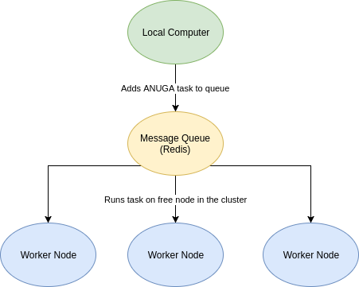

==========
QFlow
==========

.. image:: https://codecov.io/gh/JamesRamm/qflow/branch/master/graph/badge.svg
        :target: https://codecov.io/gh/JamesRamm/qflow

.. image:: https://img.shields.io/travis/openfloodmap/qflow.svg
        :target: https://travis-ci.org/openfloodmap/qflow

.. image:: https://pyup.io/repos/github/openfloodmap/qflow/shield.svg
     :target: https://pyup.io/repos/github/openfloodmap/qflow/
     :alt: Updates

QFlow runs Anuga or Tuflow models across a distributed computing cluster.
QFlow manages the distribution of model runs across the cluster automatically, ensuring maximum usage
of your HPC resources and keeping your local computer resources free for your day to day tasks.

QFlow uses Celery & Redis to manage the task queue and runs on Python 3.5+

Quick start
-----------

- Setup the message broker for celery (e.g. Redis)
- Launch 1 or more celery workers: ``celery -A qflow worker -l info -Ofair`` (run this in the directory above the qflow package)

In order to execute an ANUGA script:

.. code-block:: python

        from qflow import tasks

        result = tasks.run_anuga.delay('/path/to/my/script.py')

In the above snippet, ``result`` is a celery ``AsyncResult``